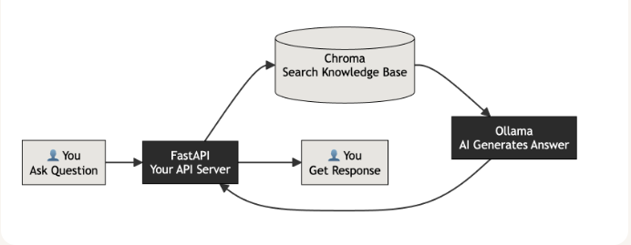
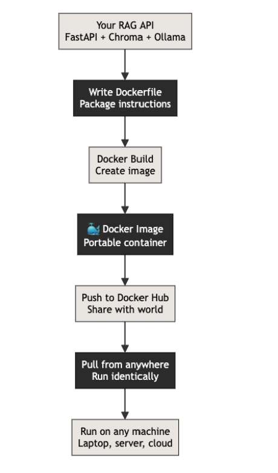
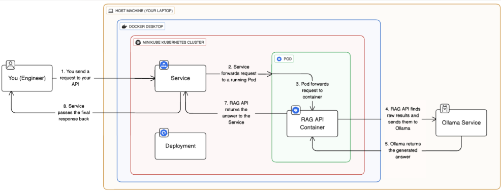

# fastapi-rag-api

A lightweight Retrieval-Augmented Generation (RAG) API built with Python and FastAPI. Upload your own files and ask questions powered by modern AI models

## How the RAG API Works

## Architecture of containerized RAG API

## Architecture of application deployed in kubernetes

